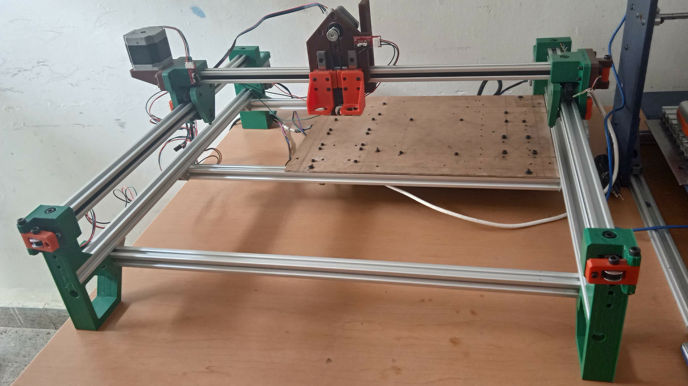
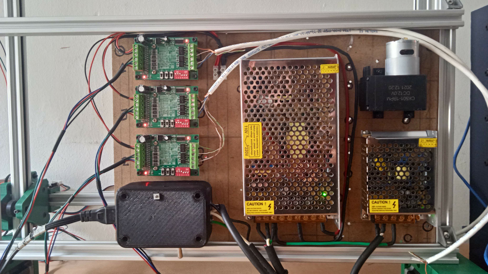
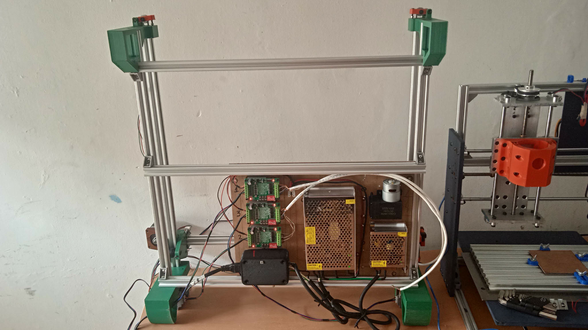

# LumenPnP 23

This is my version of the `LumenPnP` project by `Opulo`. The main change I made was add NEMA 23 stepper motors on the X and Y axis. I expect to operate at higher velocities in the XY plane.

WIP!

In the `hasecilu` branch I will making my modifications.

24V and 12V power supply, TB6560 drivers to control the NEMA23 steppers and a differnet vacuum pump. Maybe in the future I'll move the power supplies outside the machine.

Bottom view.

## Assembly

I'm playing with the `Assembly3` workbench, so I'm working in a new assembly without the `A2+` workbench.

## Modifications

There are 2 type of mods that I'm making, some FDM parts to accomodate the  NEMA 23 motors and some parts that I bought that are different from the used in the original project

The modified FDM models are in the `./pnp/cad/FDM/mods/` folder and extra models like 3rd party external `step` files are in the`./pnp/cad/EXTRA/` folder.

### FDM mods

* FDM-0003_back-left-leg_uli.FCStd
* FDM-0004_back-right-leg_uli.FCStd
* FDM-0005_y-gantry_uli.FCStd
* FDM-0006_x-motor-mount_uli.FCStd
* FDM-0011_x-gantry-front_uli.FCStd
* FDM-0017_z-gantry-left_uli.FCStd
* FDM-0039_z-gantry-right_uli.FCStd
* FDM-0040_z-gantry-backplate-left_uli.FCStd
* FDM-0041_z-gantry-backplate-right_uli.FCStd 

### Extra

* Linear rails
* Board4PowerElectronics.FCStd
* Board4PowerElectronics_v2.FCStd
* Mini vacuum pump.FCStd
* PowerSupply_12V_3A.FCStd
* PowerSupply_24V_10A.FCStd
* TB6560.FCStd

|  Changed part  |        Reason         |
| -------------- | --------------------- |
| FDM-00WX       | NEMA23 instead NEMA17 |
|                | Another linear rails  |
| Stepper driver |                       |
| Linear rails   |                       |
| Power supply   |                       |

## More

[diy-pcb-cnc](https://gitlab.com/hasecilu/diy-pcb-cnc) my other project, a small 3 axis CNC machine for making PCB's and more.

Original README. Click this to collapse/fold.

# LumenPnP
The LumenPnP is an open source [pick and place machine](https://en.wikipedia.org/wiki/Pick-and-place_machine) to aid in [Mid-Scale Manufacturing](http://stephenhawes.com/level-2-manufacturing/). 

LumenPnP kits are available for sale on the [Opulo Website](https://www.opulo.io/). Machines are being used in active production daily. If you build or buy one, please help the project by documenting bugs with a GitHub issue.

**Please [read the wiki here](https://github.com/index-machines/index/wiki)!** The wiki covers information about the state of the project, contributing instructions, and frequently asked questions.

The LumenPnP is designed to be low-cost enough that someone could buy or build one to support making production runs at home or as a small business. It runs using [OpenPnP](https://openpnp.org/).

Along with the pick and place machine itself, the project also includes feeders designed to work with the machine. Powered feeders are in the final design phase. Having a proven validated design is the next goal of the project.

The LumenPnP's development process is being cataloged in a series of videos. A playlist of these can be found [here](https://www.youtube.com/playlist?list=PLIeJXmcg1baLBz3x0nCDqkYpKs2IWGHk4).

## How do I build one?
You can buy a kit on the [Opulo Website](https://www.opulo.io/products/lumenpnp-kit) and follow the build instructions on the [docs page](https://docs.opulo.io/)!

## Contributing
If you would like to contribute to the project, awesome! Check out the [contributing page](https://github.com/index-machines/index/wiki/Contributing) to get started.

## Community
Discussion about the project happens on the [STR Discord server](https://discordapp.com/invite/TCwy6De)!

